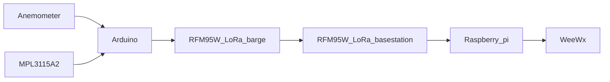

# gsc-weather

[Glenmore Sailing Club](https://www.glenmoresailingclub.com/) Weather Monitor

Providing general weather for sailors, high wind cutoff for GSC co-op boats and
live wind conditions for race committee.

# Overview



# Arduino

## Wiring

## Libraries

Libraries that need to be downloaded using Library Manager (Tools -> Manage Libraries)
* CRC - https://www.arduino.cc/reference/en/libraries/crc/
* LoRa - https://www.arduino.cc/reference/en/libraries/lora/
* EWMA - https://www.arduino.cc/reference/en/libraries/ewma/
* BMP180
   * https://github.com/adafruit/Adafruit_Sensor
   * https://github.com/adafruit/Adafruit_BMP183_Unified_Library
* Grove - IMU 9DOF - https://github.com/Seeed-Studio/Seeed_ICM20600_AK0991
* PCINT library - https://github.com/paulo-raca/YetAnotherArduinoPcIntLibrary

# Raspberry Pi

## Wiring

## Ramdisk setup
```
pi@raspberrypi:~ $ sudo mkdir /var/ramdisk
pi@raspberrypi:~ $ echo "tmpfs /var/ramdisk tmpfs nodev,nosuid,size=256k 0 0" | sudo tee -a /etc/fstab
```

## SPI Setup
```
pi@raspberrypi:~ $ sudo raspi-config
        -> Interfacing Options -> SPI -> yes -> Finish
```

## Python

### Install Python Libraries
```
python3 -m pip install crc
python3 -m pip install adafruit-circuitpython-rfm9x
```

### Running unit tests
```
~/gsc-weather $ cd basestation
~/gsc-weather/basestation $ python3 -m unittest *
```

# Credit

[Adafruit](https://www.adafruit.com) for great products and tutorials

WeeXx [pi weather station](https://github.com/weewx/weewx/wiki/Raspberry-Pi-weather-station-with-i2C-sensors), [sensors and scripts](https://github.com/weewx/weewx/wiki/i2C-sensor-and-other-python-scripts)
