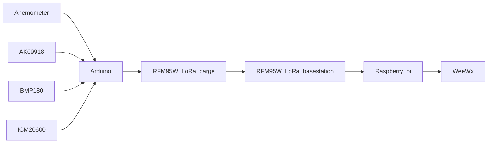

# gsc-weather

[Glenmore Sailing Club](https://www.glenmoresailingclub.com/) Weather Monitor

Providing general weather for sailors, high wind cutoff for GSC co-op boats and
live wind conditions for race committee.

# Overview



# Arduino

Add to File->Preferences->Additional Boards Manager URLs:
https://adafruit.github.io/arduino-board-index/package_adafruit_index.json

## Wiring

Atmega32u4 - Adafruit Feather 32u4

* Anemometer - 6P4C (RJ11 phone) connector
    1. black - GND
    2. red - 3V
    3. green - PCINT5 (A9)
    4. yellow - unused
* I2C sensors - VCC, GND, SDA (2), SCL(3)
* Voltage divider - A1

## Libraries

Libraries that need to be downloaded using Library Manager (Tools -> Manage Libraries)
* CRC - https://www.arduino.cc/reference/en/libraries/crc/
* LoRa - https://www.arduino.cc/reference/en/libraries/lora/
* EWMA - https://www.arduino.cc/reference/en/libraries/ewma/
* BMP180
   * https://github.com/adafruit/Adafruit_Sensor
   * https://github.com/adafruit/Adafruit_BMP183_Unified_Library
* Grove - IMU 9DOF - https://github.com/Seeed-Studio/Seeed_ICM20600_AK0991
* PCINT library - https://github.com/paulo-raca/YetAnotherArduinoPcIntLibrary
* Low-Power - https://github.com/rocketscream/Low-Power

# Raspberry Pi

## Wiring


## SPI Setup
```
pi@raspberrypi:~ $ sudo raspi-config
        -> Interfacing Options -> SPI -> yes -> Finish
```

## Python

### Install Python Libraries
```
sudo python3 -m pip install crc adafruit-circuitpython-rfm9x
```

## WeeWx
1. Install weewx (see the user guide: http://weewx.com/docs/setup.htm)
2. Zip the WeeWx-driver directory as GscLoRa.zip
3. Install the driver

    ```wee_extension --install GscLoRa.zip```
4. Configure the driver

    ```wee_config --reconfigure```

## Lighttpd

    sudo apt install lighttpd

Add ```alias.url += ( "/weewx" => "/home/weewx/public_html" )```
to file ```/etc/lighttpd/lighttpd.conf```

# Credit

[Adafruit](https://www.adafruit.com) for great products and tutorials

WeeXx [pi weather station](https://github.com/weewx/weewx/wiki/Raspberry-Pi-weather-station-with-i2C-sensors), [sensors and scripts](https://github.com/weewx/weewx/wiki/i2C-sensor-and-other-python-scripts),
[WeeWX-BCRobotics](https://github.com/David-Enst/WeeWX-BCRobotics)
